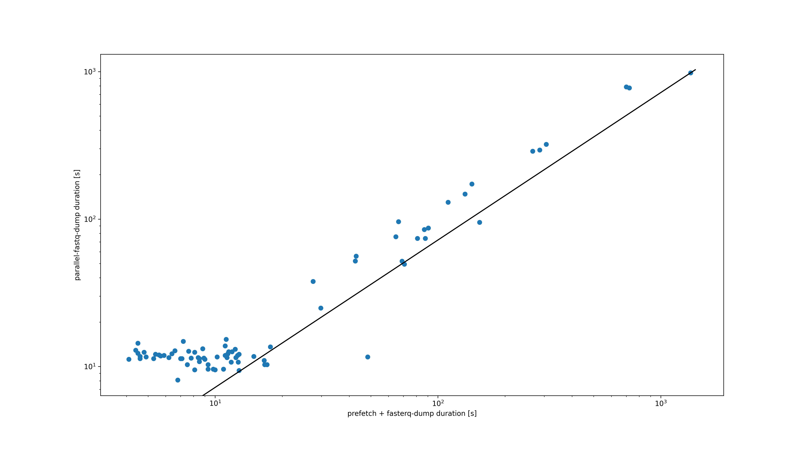

# SRA Benchmark

A benchmark pipeline that compares the performance of `prefetch` + `fasterq-dump` with `parallel-fastq-dump`.

## Usage

1. Set up nextflow as [described here](https://www.nextflow.io/index.html#GetStarted).
2. If you didn't run this pipeline in a while, possibly update nextflow itself.

  ```
  nextflow self-update
  ```

3. Then run the pipeline.

  ```
  nextflow run main.nf -profile docker --input input/mix.tsv
  ```

## Outcome

You can see the results from one run (tasks were performed sequentially to preserve bandwidth) in the [info directory](info/). In particular the [execution report](info/execution_report.html) and the figure comparing duration.



The figure shows the outcome of running the pipeline

```
nextflow run main.nf -profile conda --input input/mix.tsv
```

on a log-log scale. In general, `prefetch` + `fasterq-dump` performs better.

## Copyright

- Copyright © 2020, Unseen Bio ApS.
- Free software distributed under the [GNU Affero General Public License version 3 or later (AGPL-3.0-or-later)](https://opensource.org/licenses/AGPL-3.0).
