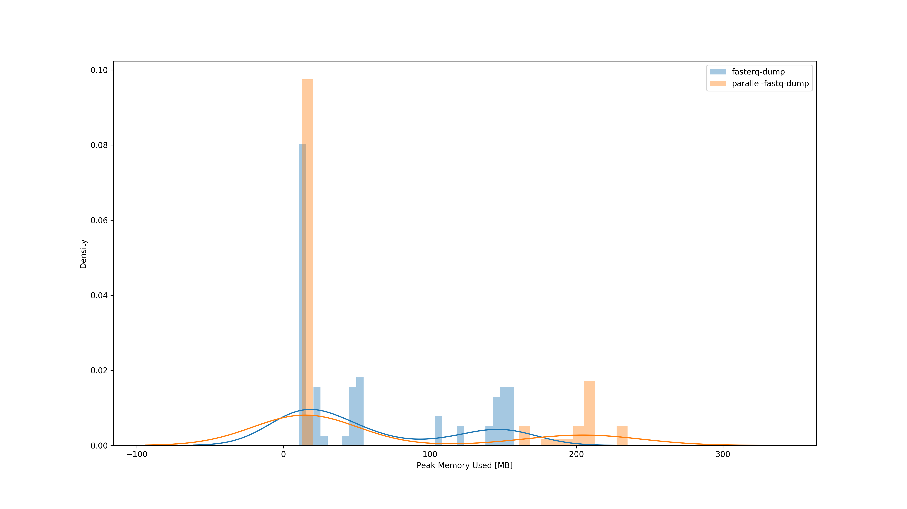

# SRA Benchmark

A nextflow benchmark pipeline that compares the performance between `fasterq-dump` and `parallel-fastq-dump` either without compression or using `fasterq-dump` + `pigz` versus `parallel-fastq-dump`'s `--gzip` flag. All combinations were tested following `prefetch`.


The benchmark consists of identifiers to

- 30 small, single-end, 16S amplicon sequencing
- 30 small, paired-end, 16S amplicon sequencing
- 10 large, single-end, shotgun whole-genome sequencing
- 10 large, paired-end, shotgun whole-genome sequencing

files. And the pipeline was run with:

```
nextflow run main.nf -profile conda --input input/mix.tsv
```

## Outcome

### Percent CPU

Density plot of the computational resources used in percent. Four CPU cores were made available to each job. Without compression `fasterq-dump` seems to use slightly less processing power but with compression it is very similar.

#### Without Compression


#### With Compression


### Peak Memory

Either with or without compression, `fasterq-dump` uses slightly less memory than `parallel-fastq-dump`. However, in the context of genomics these are negligible numbers anyway. The pipeline was configured in a way that both processes use a memory-mapped temporary directory for their work which requires tens of GB.

#### Without Compression



#### With Compression


### Duration

The duration in seconds used by `fasterq-dump` (+ `pigz`) and `parallel-fastq-dump` respectively, for the same sequence, shown on log-log scale. Without compression, `parallel-fastq-dump` is faster in the majority of cases. With compression, `fasterq-dump` + `pigz` are faster. This probably means that `pigz` performs better than what is used by `fastq-dump --gzip`.

#### Without Compression


#### With Compression


You can find the entire pipeline definition, [input files](input/mix.tsv), [detailed pipeline reports](info/), as well as the [analysis code](performance.ipynb) in this repository.

## Copyright

- Copyright © 2021, Unseen Bio ApS.
- Free software distributed under the [GNU Affero General Public License version 3 or later (AGPL-3.0-or-later)](https://opensource.org/licenses/AGPL-3.0).
